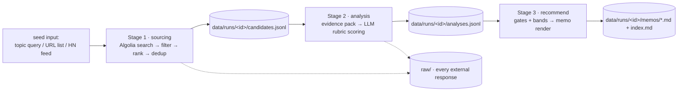

# Emergence — Implementation Plan

> Status: agreed direction, pre-implementation. Living document — material deviations
> get recorded as short notes in `docs/decisions/`, not by silently rewriting this file.

## 1. Goal

One command — `uv run emergence run --query "AI agents for SMBs"` — produces:

1. 10–20 sourced candidate startups,
2. a structured, evidence-cited analysis per candidate,
3. a one-page memo per candidate ending in **Pass / Watch / Take a meeting**.

All run outputs are committed under `data/runs/<run-id>/`, so a reviewer can inspect
everything without re-running anything.

## 2. Scope — what we build and what we deliberately don't

**Picked: Hacker News, deep.** "Show HN" and "Launch HN" posts *are* startup launches,
and they carry the required signals for free: freshness (post date), traction
(points, comment count), a founder signal (the posting account), and a comment thread
that often includes the founders answering questions. Two free, stable, auth-less APIs:

- **Algolia HN Search** (`hn.algolia.com/api/v1/search`) — full-text story search with
  tags and numeric filters → candidate discovery from a topic query.
- **Firebase HN** (`hacker-news.firebaseio.com/v0`) — items, comment trees, user
  profiles → thread + author enrichment.

**Enrichment (analysis stage, not counted as sourcing sources):** the candidate's own
website (homepage + about/team/careers pages), and GitHub org activity via the public
API when a repo/org is discoverable from the site.

**Deliberately cut:**

| Cut | Why |
|---|---|
| Product Hunt, X/Twitter, Crunchbase | Auth-walled or paid APIs. Two-deep-sources beats twelve-shallow — the brief explicitly names the "12 sources × 2 garbage results" anti-pattern. |
| LinkedIn scraping | ToS-prohibited. Team signal comes from team pages, HN author history, GitHub. |
| Vector DB / embeddings | n ≤ 20 candidates; keyword filters + LLM judgment are sufficient and far simpler. |
| Web UI, job queue, SQL DB | Explicitly out of scope per the brief. Files + CLI. |
| Async crawl farm | Polite sequential fetching with timeouts is fine at this scale. |

## 3. Architecture



Rules that keep the system honest and replayable:

- **Stages communicate only through files** in the run directory. No in-memory handoff.
  Any stage is re-runnable: `emergence run --from-stage analysis` reuses earlier files.
- **Every external response is persisted** under `raw/` (HN API JSON verbatim; website
  pages as capped text excerpts, ~8 KB/page — enough to support a claim, small enough
  to commit). This is what makes memo claims traceable and replays free.
- **The LLM never computes the final score.** It assigns 0–5 subscores against anchored
  rubric criteria and must attach a source URL to every claim. Code computes the 0–100
  weighted score and the call. Deterministic, auditable, consistent across candidates.

### Stage contracts (pydantic models, all serialized to run files)

- `Candidate` — name, website, one-liner, `source` (HN story id + URL), HN signals
  (points, comments, posted_at, author), founder hint from post text.
- `EvidencePack` — per-candidate raw material index: website page excerpts, HN thread
  top comments, author profile (karma, account age), GitHub org snapshot if found.
  Each entry records its source URL and fetch timestamp.
- `Analysis` — four sections (`team`, `product`, `market`, `risks`), each:
  subscore 0–5 + rationale + `claims: [{text, source_url}]`; plus `red_flags[]` and
  `llm_meta` (model, prompt file + content hash, token counts, latency).
- `Score` — computed in code from rubric weights; gate evaluation result.
- `Memo` — call, rationale, "what would change my mind", rendered to Markdown.

## 4. Scoring design

Defined in [`../thesis.md`](../thesis.md) (versioned, so the bar itself has history).
Summary:

| Dimension | Weight |
|---|---|
| Team | 25 |
| Product | 20 |
| Market & why-now | 20 |
| Traction & freshness | 20 |
| Thesis fit | 15 |

Each dimension is scored 0–5 by the LLM against anchored descriptors (what a 1, 3, 5
look like), then mapped to its weight. Hard gates (dead site, no identifiable product,
excluded category, no findable team) force **Pass** regardless of total. Bands:
≥70 Take a meeting · 50–69 Watch · <50 Pass.

## 5. LLM strategy

- **Provider-agnostic OpenAI-compatible client** configured by env: `LLM_BASE_URL`,
  `LLM_API_KEY`, `LLM_MODEL`. Default points at local Ollama (`http://localhost:11434/v1`).
- Structured JSON output validated against pydantic schemas; **one repair retry** on
  validation failure; if still invalid, the analysis is marked *degraded* and the memo
  says so — robustness to bad/missing data is graded, and silent failure is worse than
  an honest "insufficient data".
- `--mock-llm` mode: deterministic canned responses for tests and offline development.
- Prompts live in `prompts/` as versioned files — prompt iteration shows up in git diffs.
- Every LLM call is logged into the run directory (model, prompt hash, tokens, latency).
- The model used for the committed demo run is recorded in the run metadata and in
  `docs/process.md`.

## 6. Repository layout

```
emergence/
├── thesis.md               # the investment thesis + anchored rubric (versioned)
├── prompts/                # versioned prompt templates
├── src/emergence/
│   ├── cli.py              # one command end-to-end, plus per-stage commands
│   ├── sourcing/           # HN clients, filters, ranking
│   ├── analysis/           # evidence pack builder, LLM client, scoring
│   ├── recommend/          # call mapping, memo rendering
│   └── models.py           # pydantic stage contracts
├── prompts/
├── tests/                  # fixtures only — no live network in tests
├── data/runs/<run-id>/     # committed outputs: raw/, candidates, analyses, memos
└── docs/
    ├── plan.md             # this file
    ├── decisions/          # short ADR-style notes, written when decisions happen
    └── process.md          # factual AI-usage log (+ human-written reflection)
```

## 7. Testing

`pytest`, fixtures under `tests/fixtures/` captured from real API responses. No live
network in tests. Coverage targets the parts where bugs are expensive: score/gate
arithmetic, HN payload parsing with malformed or missing fields, domain dedup, memo
rendering, and an end-to-end smoke test through `--mock-llm`.

## 8. Process visibility (40% of the grade — designed in, not bolted on)

- **Commit history is the spine**: small commits, conventional prefixes, bodies that
  explain *why*, written as work happens — never reconstructed afterwards.
- `docs/plan.md` (this file) + `docs/decisions/` for in-build decisions +
  `docs/process.md` as a running, factual log of AI usage: what the assistant produced,
  what the human directed/rejected/fixed, what failed. Reflective sections are drafted
  as prompts and written by Prakash himself — ghostwritten reflection is both against
  the rules and easy to spot.
- `prompts/` versioned → prompt evolution is diff-able.
- Committed `data/runs/` including `raw/` evidence → every memo claim is checkable.

## 9. Milestones → commit plan

| # | Milestone | Commit(s) |
|---|---|---|
| 1 | Repo scaffold (uv, src layout, env template) | `chore: scaffold project` |
| 2 | This plan + process log skeleton | `docs: implementation plan` |
| 3 | Thesis + anchored rubric | `docs: investment thesis` |
| 4 | Stage contracts (models) + HN sourcing | `feat(sourcing): …` + tests |
| 5 | Evidence pack builder with raw caching | `feat(analysis): evidence…` |
| 6 | LLM client (OpenAI-compatible + mock) + prompts + scoring | `feat(analysis): llm…` |
| 7 | Call mapping + memo template + index | `feat(recommend): …` |
| 8 | CLI wiring: single-command run + `--from-stage` replay | `feat(cli): …` |
| 9 | Real demo run on the topic query; commit outputs | `chore: demo run outputs` |
| 10 | README finalization + process log completion | `docs: …` |

## 10. Risks and mitigations

| Risk | Mitigation |
|---|---|
| Small local models (Ollama 8B) mangle JSON or under-analyze | Strict schema validation + repair retry + mock mode; demo run may use a stronger hosted model if available — either way the model is recorded per run. |
| Algolia relevance is noisy for niche queries | Title filters (Show/Launch HN), engagement threshold, domain dedup; `--urls` seed fallback if a query underperforms. |
| Website fetching is flaky (timeouts, JS-only sites) | Timeouts, capped excerpts, partial-evidence path; missing evidence lowers confidence and shows up in the memo. |
| Thin founder signal without LinkedIn | Triangulate: HN author history, site team pages, GitHub. Memo states confidence explicitly instead of bluffing. |
